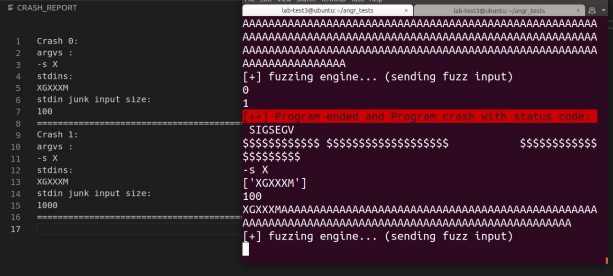

# SymDynFuzz

Very first steps of Concolic execution engine that auto analysis information flow and fuzz the programs on the actual Tizen device.

## Setup
1. Install angr-dev:

https://github.com/angr/angr-dev

2. `$ workon angr`

3. `$ git clone https://github.com/visionius/SymDynFuzz`

4. `$ cd SymDynFuzz`

5. Set <IP,Port> in symdynfuzz.py.

6. `$ python3 symdynfuzz.py <max-argv-numbers> <max-argv-size>`

## Example

After compiling the blow program and installing it on the Tizen device, fireup the script to analyze the program on the target device.

```c 
#include <stdio.h>
#include <string.h>
int main(int argc, char** argv)
{
    char buffer[40];
    char input[100];
    if(argc > 1)
    {
        if(!strcmp(argv[1], "-s"))
        {
            fgets(input, 100, stdin);
            if(input[1] == 'G' && input[5] == 'M')
            {
                strcpy(buffer, input);
            }
        }
    }
    else
    {
        printf("[-] Usage with flag (-s)\n");
    }
}
```
SymDynFuzz results stored in CRASH_REPORT.


