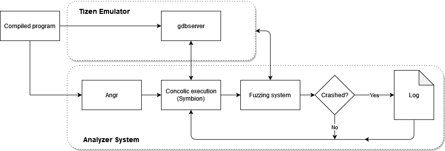

# SymDynFuzz

Concolic analysis engine that auto analysis information flow and fuzz the programs on the actual Tizen device.

#Architecture overview



## Setup
1. Install angr-dev:

    https://github.com/angr/angr-dev

2. Execute `$ workon angr`

3. Run `$ git clone https://github.com/visionius/SymDynFuzz`

4. Run `$ cd SymDynFuzz`

5. Set <IP,Port> in symdynfuzz.py.

6. Setup SSH server and pass it into `username` and `password` in symdynfuzz.py and automation.py

7. Install Tizen-Studio (install all the requirements for mobile applications). Then add compile options *-no-pie* and *-fno-stack-protector* for gcc compile option in "tizen-studio\tools\ide\resources\native\Build"

8. Copy envfiles/setup.bat and envfiles/compile_install.bat to tizen-studio folder

9. Run `$ python3 symdynfuzz.py <max-argv-numbers> <max-argv-size> [<|stdin|argv|>]*`

## Example

After compiling the blow program and installing it on the Tizen device, fireup the script to analyze the program on the target device.

```c 
#include <stdio.h>
#include <string.h>
int main(int argc, char** argv)
{
    char buffer[40];
    char input[100];
    if(argc > 1)
    {
        if(!strcmp(argv[1], "-s"))
        {
            fgets(input, 100, stdin);
            if(input[1] == 'G' && input[5] == 'M')
            {
                strcpy(buffer, input);
            }
        }
    }
    else
    {
        printf("[-] Usage with flag (-s)\n");
    }
}
```
SymDynFuzz results on NIST SARD benchmark C programs are stored in *CRASH_REPORT.txt* file.


